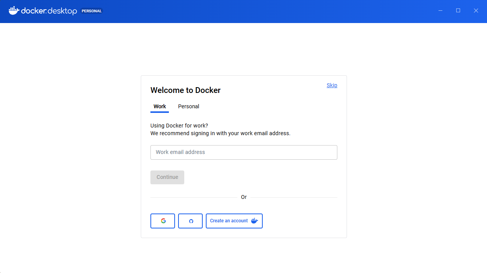
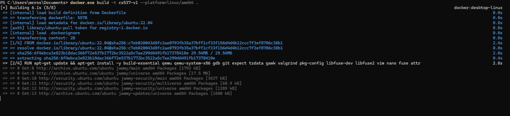
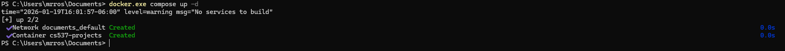
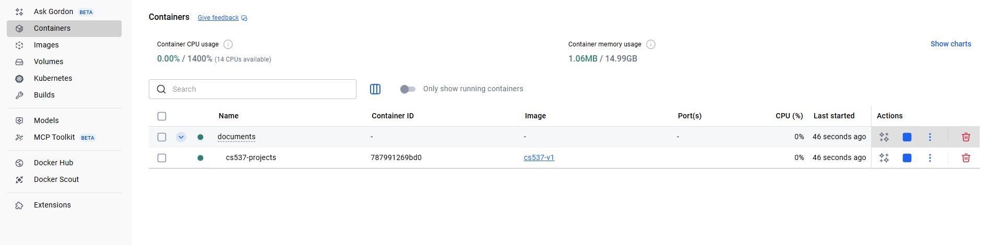
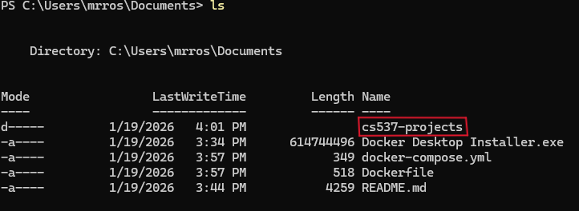
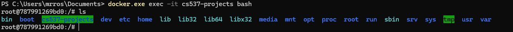

## Install docker-desktop

Follow the instructions on Docker's official website to [install Docker-desktop](https://docs.docker.com/desktop/setup/install/windows-install/)  on your machine.


If the installation is successful, you should see the following window that asks you to log in to your account:


Sign up or log in to a docker account. Then, you need to open a powershell window and follow these steps:
### Download the Necessary Docker Config Files
From [this](https://git.doit.wisc.edu/cdis/cs/courses/cs537/useful-resources/cs537-docker) repo you need to download two files: `Dockerfile` and `docker-compose.yml`. Put these files in the same directory on your machine, then `cd` to that directory in your powershell and perform the following steps.
### Build the Docker Image locally

Run the following command to build the Docker image (don't forget the trailing dot): 
```bash
docker.exe build -t cs537-v1 --platform=linux/amd64 .
```


It should create a Docker image named `cs537-v1`. You can view it on the left-side menu inside Docker desktop by clicking on `Images`. Note that it may take a few minutes to finish the build process.

### Bring up the Docker Compose Environment

Start the container with Docker Compose by running (you must still be in the same directory as your `Dockerfile` and `docker-compose.yml` files):
```bash
docker.exe compose up -d
```


This will start a container named `cs537-projects`. You can view it by clicking on `Containers` on the left-side menu:


You should also see a new directory `cs537-projects/` in the current folder. This directory is mounted to `/cs537-projects` inside the container, meaning any changes you make in `./cs537-projects` on your host machine will be reflected in the container's `/cs537-projects` directory.  This folder is where you should do all of your assignments for the course.  Individual assignment repositories should be cloned into this directory.


### Access the container

To access the container, run:
```bash
docker.exe exec -it cs537-projects bash
```

It opens a bash session inside the container. You can run this command multiple times to open multiple bash sessions in the same container.  When you are finished with your bash session inside the container, simply `exit`.


### Stop the container

Once you're done using the container, you can stop it with:
```bash
docker.exe stop cs537-projects
```

Stopping the container does not delete it or the work inside.


## Reusing the container 

Once the docker image and the container are created, it will remain saved on your machine. So, the next time you want to use this container, follow these steps:

1. **Start the container**
    ```bash 
    docker.exe start cs537-projects
    ```

2. **Access the container with bash**
    ```bash
    docker.exe exec -it cs537-projects bash
    ```

3.  **Stop the container** (after exiting the bash session)
    ```bash
    docker.exe stop cs537-projects
    ```
    
    You can also start/stop containers using the Docker desktop GUI, using the `Containers` tab from the left-side menu.
